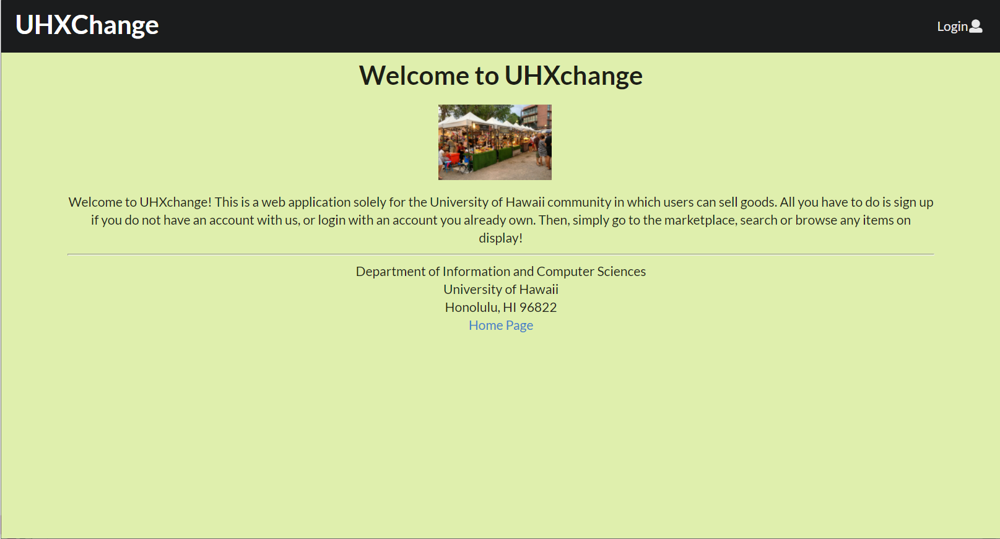
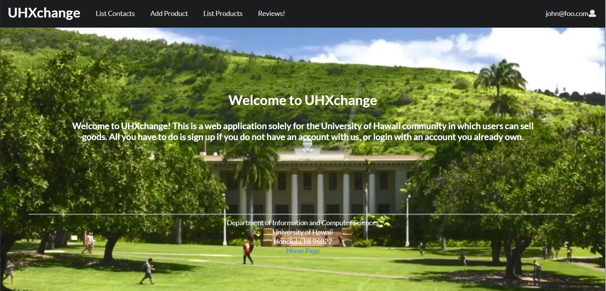
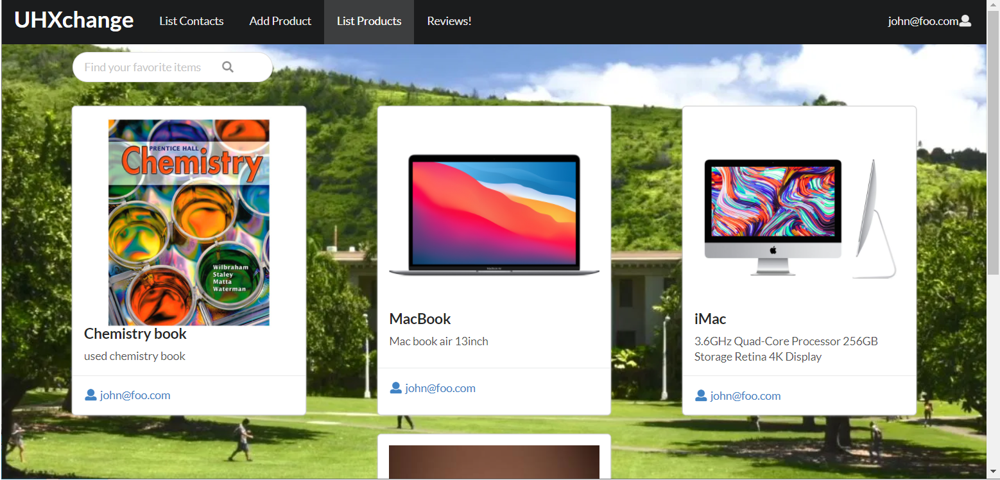
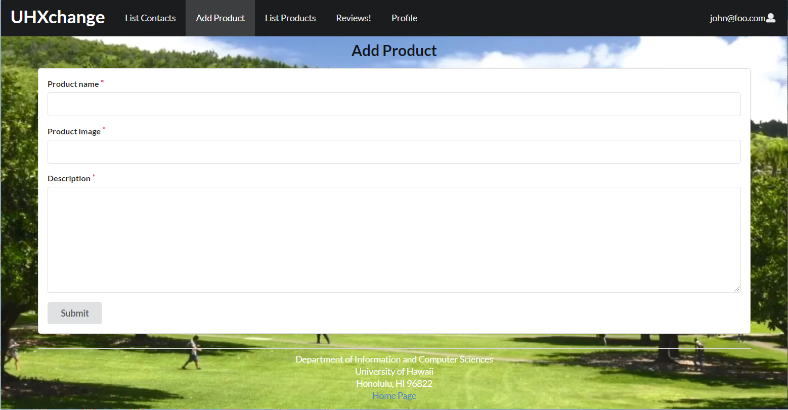
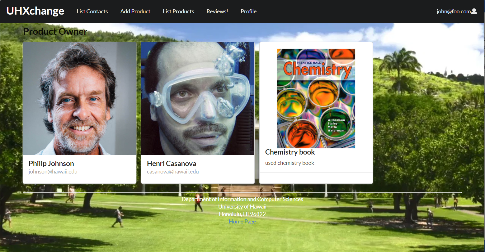
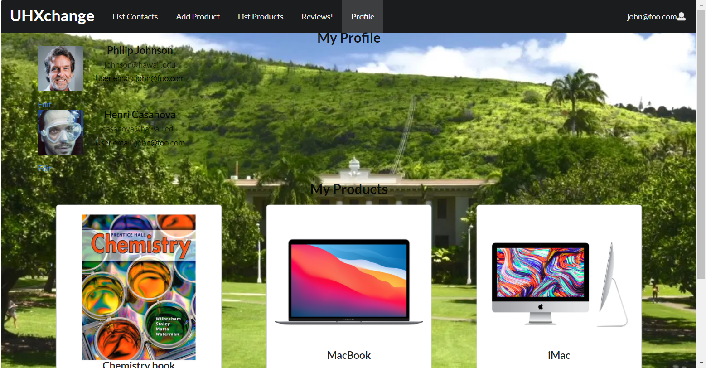

# Welcome to UHXchange!

## Table of contents

* [Overview](#overview)
* [User Guide](#user-guide)
* [Deployment History](#deployment-history)
* [Team](#team)

## About UHXchange

UHXchange is a web application that provides users to buy and sell items in the UH Manoa community. Users are able to search up items, purchase items, or exchange. Ultimately, it will allow two users to interact with each other and decide either they want to exchange goods or purchase with currency. We will allow users the option to either message the "seller" directly and decide from their. On the product page, it will show the user, the product the user is putting up to sell or trade, and a field that indicate if the seller wants to only sell, only trade, or open to both. The choice is theirs.

This web application illustrates various technologies useful to ICS software engineering students, including:

* [Meteor](https://www.meteor.com/) for Javascript-based implementation of client and server code.
* [React](https://reactjs.org/) for component-based UI implementation and routing.
* [Semantic UI React](https://react.semantic-ui.com/) CSS Framework for UI design.
* [Uniforms](https://uniforms.tools/) for React and Semantic UI-based form design and display.

## User Guide

### Landing page

This is a potential landing homepage where users can search up any potential item they're searching for, as well as showing a recent purchase feed and website information.

### Sign in and sign up

Click on the "Login" button in the upper right corner of the navbar, then select "Sign up" to go to the following page and register as a new user:

Click on the "Login" button in the upper right corner of the navbar, then select "Sign in" to go to the following page and login:

### List contacts page

The List contacts page shows all the current registered profiles and their associated email addresses:

### Add product Page

Once you are logged in, you can define new products with the Add product page:

### List products page

The List Products page shows all of the currently defined Products and their associated descriptions and email addresses:

## Deployment History

[UHXchange](https://uhxmanoa.xyz/#/) is running on Digital Occean.

### Milestone 1: Mockup Development and Authentication

Milestone 1 started on April 8, 2021 and completed April 15, 2021. 

The goal of Milestone 1 was to create collections and a mockup of pages in the system.

Milestone 1 was managed using [UHXchange GitHub Project M1](https://github.com/uhxchange/uhxchange/projects/1)

### Milestone 2: Mockup Development

Milestone 2 started on April 16, 2021 and completed April 27, 2021. 

The goal of Milestone 2 was to improve the functionality and quality of our application.

Milestone 2 was managed using [UHXchange GitHub Project M2](https://github.com/uhxchange/uhxchange/projects/3)

LandingPage:

ListSignedInPage:

ListProductsPage:

ReviewPage:

AddProductPage:

ProductPage:

ProfilePage:

### Milestone 3: Mockup Development

Milestone 3 started on April 28, 2021.

The goal of Milestone 3 is to significantly improve the functionality from Milestone 2 and to implement testing before finalizing the project.

Milestone 3 will be managed using [UHXchange GitHub Project M3](https://github.com/uhxchange/uhxchange/projects/4)

## Team

UHXchange is designed, implemented, and maintained by
[Jiyeon Chun](https://chunjy.github.io/), [Chin Ting Liao](https://chintingliao.github.io/), [Hansen Cabanero](https://hanseca.github.io/), [Tam Nguyen](https://tamtn2.github.io/)
