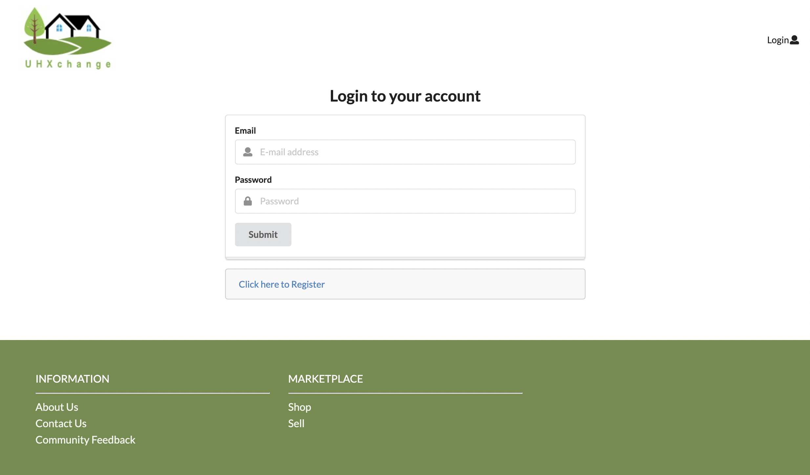
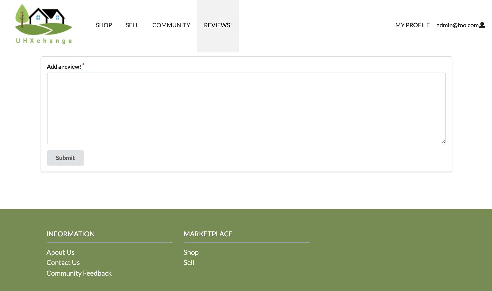

# Welcome to UHXchange!

## Table of contents

* [Overview](#overview)
* [User Guide](#user-guide)
* [Developer Guide](#developer-guide)
* [Deployment History](#deployment-history)
* [Community Feedback](#community-feedback)
* [Team](#team)


## About UHXchange

UHXchange is a web application that provides users to buy and sell items in the UH Manoa community. Users are able to search up items, purchase items, or exchange. Ultimately, it will allow two users to interact with each other and decide whether they want to exchange goods or purchase with currency. The Shop page will have a list of products the students have uploaded with a field that indicate if the seller wants to only sell, only trade, or open to both. The choice is theirs.

This web application illustrates various technologies useful to ICS software engineering students, including:

* [Meteor](https://www.meteor.com/) for Javascript-based implementation of client and server code.
* [React](https://reactjs.org/) for component-based UI implementation and routing.
* [Semantic UI React](https://react.semantic-ui.com/) CSS Framework for UI design.
* [Uniforms](https://uniforms.tools/) for React and Semantic UI-based form design and display.


## User Guide

### Landing page

Landing page has a brief description of the website and sign in and sign up buttons:


### Sign in, sign up, sign out

Click on the "Login" button in the upper right corner of the navbar, then select "Sign up" to go to the following page and register as a new user:


Click on the "Login" button in the upper right corner of the navbar, then select "Sign in" to go to the following page and login:



Click on the user email in the upper right corner of the navbar, then select "Sign out" to go to the following page:


### Shop page

The Shop page shows all of the currently defined items and their associated descriptions:


### Product page

Once the user clicks on a specific item, it leads to a product page showing the seller information. The label shows whether the user is selling or trading the item. Students can arrange the meet up through email:


### Search bar

The user can utilize the search bar located in the left upper corner of the Shop page. It returns all the items related to the keyword:


### Sell page

The user can create a listing on the Sell page. The form asks to fill out product name, image, description, and sale type:


### Community page

The Community page shows all the current registered users and their associated email addresses:


### Profile page

When the user clicks on a specific profile on the community page, it lists all the products the user is selling:


### Review page

The review page allows the registered students to add a review on the webiste:



### My Profile page

The My Profile page allows the user to edit the profile and edit/delete the products information:


### Edit Profile

On My Profile page, the user can click on the edit button located under the profile image to edit profile:


### Edit Product

On My Profile page, the user can click on the edit button on the product card to edit product information:


### Admin Role

Admin can edit or remove any items from the Shop page and edit inappropriate profile information on the Community page:


## Developer Guide

This section provides information of interest to Meteor developers wishing to use this code base as a basis for their own development tasks.

### Installation

First, [install Meteor](https://www.meteor.com/install).

Second, visit the [UHXchange application github page](https://github.com/uhxchange/uhxchange), and click the "Use this template" button to create your own repository initialized with a copy of this application. Alternatively, you can download the sources as a zip file or make a fork of the repo.  However you do it, download a copy of the repo to your local computer.

Third, cd into the uhxchange/app directory and install libraries with:

```
$ meteor npm install
```

Fourth, run the system with:

```
$ meteor npm run start
```

If all goes well, the application will appear at [http://localhost:3000](http://localhost:3000).

### Application Design

UHXchange is based upon [meteor-application-template-react](https://ics-software-engineering.github.io/meteor-application-template-react/) and [meteor-example-form-react](https://ics-software-engineering.github.io/meteor-example-form-react/).

## Initialization

The [config](https://github.com/uhxchange/uhxchange/tree/master/config) directory is intended to hold settings files.  The repository contains one file: [config/settings.development.json](https://github.com/uhxchange/uhxchange/blob/master/config/settings.development.json).

This file contains default definitions for Contacts and Products and the relationships between them.

The settings.development.json file contains a field called "loadAssetsFile". It is set to false, but if you change it to true, then the data in the file app/private/data.json will also be loaded.  The code to do this illustrates how to initialize a system when the initial data exceeds the size limitations for the settings file.

### Quality Assurance

#### ESLint

UHXchange includes a [.eslintrc](https://github.com/uhxchange/uhxchange/blob/master/app/.eslintrc) file to define the coding style adhered to in this application. You can invoke ESLint from the command line as follows:

```
meteor npm run lint
```

Here is sample output indicating that no ESLint errors were detected:

```
$ meteor npm run lint

> bowfolios@ lint /Users/philipjohnson/github/uhxchange/uhxchange/app
> eslint --quiet --ext .jsx --ext .js ./imports ./tests

$
```

ESLint should run without generating any errors.

It's significantly easier to do development with ESLint integrated directly into your IDE (such as IntelliJ).

## From mockup to production

UHXchange is meant to illustrate the use of Meteor for developing an initial proof-of-concept prototype.  For a production application, several additional security-related changes must be implemented:

* Use of email-based password specification for users, and/or use of an alternative authentication mechanism.
* Use of https so that passwords are sent in encrypted format.
* Removal of the insecure package, and the addition of Meteor Methods to replace client-side DB updates.


## Deployment History

[UHXchange](https://uhxmanoa.xyz/#/) is running on Digital Occean.

### Milestone 1: Mockup Development and Authentication

Milestone 1 started on April 8, 2021 and completed April 15, 2021. 

The goal of Milestone 1 was to create collections and a mockup of pages in the system.

Milestone 1 was managed using [UHXchange GitHub Project M1](https://github.com/uhxchange/uhxchange/projects/1)

### Milestone 2: Mockup Development

Milestone 2 started on April 16, 2021 and completed April 27, 2021. 

The goal of Milestone 2 was to improve the functionality and quality of our application.

Milestone 2 was managed using [UHXchange GitHub Project M2](https://github.com/uhxchange/uhxchange/projects/3)

### Milestone 3: Mockup Development

Milestone 3 started on April 28, 2021 and completed May 12, 2021.

The goal of Milestone 3 was to significantly improve the functionality from Milestone 2 and to implement testing before finalizing the project.

Milestone 3 was managed using [UHXchange GitHub Project M3](https://github.com/uhxchange/uhxchange/projects/4)


## Community Feedback

>> This website is a good alternative to Craiglist and in some cases, better as it provides simple layouts
- Braden Betz

> I can imagine myself using this website as it does all I need when it comes to finding something on the flea market
- William Dunn


## Team

UHXchange is designed, implemented, and maintained by
[Jiyeon Chun](https://chunjy.github.io/), [Chin Ting Liao](https://chintingliao.github.io/), [Hansen Cabanero](https://hanseca.github.io/), [Tam Nguyen](https://tamtn2.github.io/)
